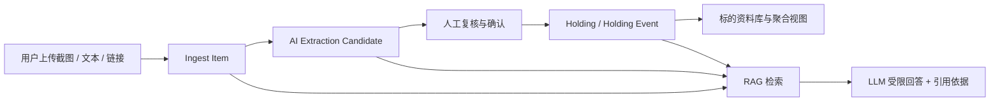

# 私有投资研究资料库与问答 Agent

## 项目概述

**项目名称：** Portfolio Intelligence Tracker

**项目类型：** AI 私有资料库与研究问答工作台

**开发方式：** 独立设计与开发

**当前阶段：** 可运行 MVP / 封闭测试版本
**开发时间：** 2026.05 - 至今

Portfolio Intelligence Tracker 是一款面向个人投资研究场景的 AI 辅助工具。用户可以录入投资相关截图、文本或链接，经 AI 解析与人工确认后，将分散资料沉淀为结构化标的资料库，并通过连续对话方式查询已有研究线索、来源依据和近期变化。

项目不提供投资推荐或实时行情判断，其核心价值是帮助用户管理自己的研究资料，并在明确证据边界下提高信息整理与回顾效率。

## 项目背景

在个人投资研究过程中，重要信息经常散落在截图、社交媒体帖子、研究笔记、网页链接及 filing 片段中，存在以下问题：

1. 资料保存零散，后续难以按标的快速回顾。
2. 图片或非结构化文本中的关键信息需要手工整理，重复劳动较多。
3. 普通检索只能找到原始资料，无法围绕同一标的连续追问。
4. 直接使用大语言模型回答容易产生资料库外推断，尤其在投资场景中存在误导风险。
5. 用户上传的投资截图和研究资料具有隐私敏感性，需要数据隔离、删除和访问控制能力。

基于上述问题，本项目将产品主流程定义为：

> 资料录入 -> AI 解析 -> 人工确认 -> 结构化资料库 -> 基于证据的连续问答

## 产品目标

项目重点解决三类问题：

- **资料结构化：** 将截图、文本和链接中的标的与研究动作提取为可管理资料。
- **问答可解释：** 使用用户自己的资料库回答问题，并展示支撑回答的依据。
- **数据可控：** 让用户能够隔离、导出和删除自己的敏感研究资料。

## 核心功能

### 1. 多类型资料录入

用户可以录入：

- 截图资料，例如社交媒体帖子或研究记录截图。
- 文本资料，例如个人研究摘要或摘录内容。
- 链接资料，例如外部信息源链接。

上传图片存储于私有 Supabase Storage bucket，界面仅通过短期 signed URL 提供预览，避免公开暴露原始文件。

### 2. AI 解析与人工确认

系统对录入内容进行候选字段解析，提取标的、动作与摘要等结构化信息：

- 文本和链接内容可调用 DeepSeek-compatible LLM 解析。
- 图片内容可调用 Kimi Vision-compatible provider 解析。
- Provider 未配置或调用失败时，系统支持规则解析回退。

AI 解析结果不会直接成为正式资料。系统设计了人工确认闭环：

```text
原始资料 -> Extraction Candidate -> 人工修改/确认 -> Holding / Holding Event
```

这一设计将模型识别结果与用户确认后的事实记录区分开，减少错误解析直接污染资料库的风险。

### 3. 标的资料库与聚合视图

经用户确认后的资料按 ticker 聚合，形成标的资料库。用户可以查看：

- 当前已确认标的。
- 每个标的的最新动作和资料来源。
- 最近确认事件。
- 用于辅助浏览的标的热力图。

总览页经过产品简化，移除了对普通用户价值有限的置信度分数、底层 trace 详情和调试信息，优先展示用户能够直接理解和使用的资料聚合结果。

### 4. 连续对话式 RAG 问答

系统提供“问资料库”功能，支持用户围绕已存资料连续提问，例如：

- 当前资料库中有哪些标的？
- `NET` 的依据是什么？
- 最近有哪些变化？
- 当前资料中是否出现风险线索？

回答链路采用 `RAG + LLM`：

1. 根据当前问题和最近对话上下文识别问题意图。
2. 从已确认 holdings、holding events、录入资料和解析候选中检索相关记录。
3. 将检索命中的上下文发送给 LLM 生成更自然的回答。
4. 在界面中展示本轮回答引用的依据资料。

问题意图目前覆盖：

- 仓位或标的概览。
- 证据和来源查询。
- 风险线索查询。
- 最近变化查询。
- 来源追溯查询。

### 5. LLM 回答边界

由于本项目处理投资研究资料，回答生成必须遵守明确边界：

- 仅基于用户资料库中检索到的内容回答。
- 不补充资料库以外的外部事实。
- 不提供实时行情信息。
- 不生成投资建议。
- 资料不足时明确说明无法从当前资料得出结论。

该边界通过系统 prompt、检索上下文约束和前端提示共同实现，使 LLM 承担语言组织能力，而不是成为未经验证的事实来源。

### 6. 数据导出、删除与运维状态

设置页提供以下用户控制能力：

- 导出当前账户资料库 JSON。
- 删除当前账户的录入、候选、持仓、事件及关联图片文件。
- 查看文本解析、Vision、RAG LLM 和图片存储 provider 的配置状态。
- 查看当前用户持久化保存的 AI 调用保护额度与使用量。
- 查看隐私与回答边界说明。

删除流程优先清理关联对象存储文件；若文件删除失败，数据库记录不会提前清空，以便追查与重试。

## 技术架构

### 技术栈

| 模块 | 技术选型 |
| --- | --- |
| 前端 | React 19、Vite 8、TypeScript |
| 后端 | Fastify、TypeScript |
| 数据契约 | Zod |
| 数据库 | Supabase PostgreSQL |
| 数据访问 | Drizzle ORM |
| 文件存储 | Supabase Storage |
| 用户认证 | Supabase Auth |
| AI 解析 | DeepSeek-compatible API、Kimi Vision-compatible API |
| 问答生成 | RAG + OpenAI-compatible LLM |
| 工程组织 | npm workspaces |

### 工程结构

```text
portfolio-intelligence-tracker/
  apps/
    web/                 # React 前端工作台
    api/                 # Fastify API 与业务模块
      drizzle/           # SQL migrations
      src/
        db/              # Drizzle schema 与数据库脚本
        extraction/      # 文本 / Vision 解析 provider
        rag/             # 检索与回答生成
        repositories/    # mock / database repository
        storage/         # 图片对象存储
  packages/
    shared/              # Zod schema 与共享类型
  docs/                  # 产品、架构、安全与 API 文档
```

### 核心数据流



## 安全与隐私设计

投资截图与研究笔记属于敏感用户资料，因此项目将安全和隐私作为核心产品能力而非后置功能。

### 已实现控制

- 支持本地固定用户开发模式和 Supabase Auth 外部认证模式。
- 所有业务数据读写均绑定已验证的 `user_id`。
- 数据库 migration 为用户资料表增加 `user_id` 索引与 Supabase RLS policy。
- 新上传图片按 `ingest/{userId}/...` 进行对象路径分区。
- 图片使用私有存储与短期 signed URL 预览。
- 前端不接触 LLM provider key、数据库凭证或 Supabase service role key。
- 用户可导出并删除当前账户资料；删除同时清理关联图片。
- 操作日志只记录必要的操作事件、用户标识和统计数据，不记录资料正文或密钥。

### 正式发布前仍需完成

- 在生产 Supabase 环境执行并复核 migration 与 RLS policy。
- 开启正式 Supabase Auth 配置并执行双账户越权测试。
- 建立持久化 AI 调用计量、成本告警及跨实例限流。
- 完成备份保留、删除审计及正式隐私政策发布流程。

## 工程验证

当前版本已完成以下验证：

- 真实 Supabase dev 数据库 migration 与数据读写验证。
- 真实图片对象存储与短期预览链接验证。
- 文本解析与 Vision 图片解析链路验证。
- 人工确认后正式 holding / holding event 写入验证。
- RAG 连续问答、问题意图区分和 LLM 回退逻辑验证。
- 浏览器端总览、录入、资料库、问答与设置页面验证。
- `25` 项 API 自动化测试通过，覆盖核心写入流程、连续问答、数据删除和双用户数据隔离。
- TypeScript typecheck 与前端生产构建通过。

## 项目亮点

### 1. 从功能原型转向可信资料闭环

项目并非简单调用模型生成答案，而是通过“候选解析 -> 人工确认 -> 正式资料”的流程保证资料库可信度，使 AI 的输出有明确使用边界。

### 2. 将 RAG 的回答体验与风险边界同时落地

项目针对模板问答过于机械的问题加入 LLM 生成能力，又针对投资研究场景限制模型只能引用资料库内容，在可用性和风险控制之间取得平衡。

### 3. 将隐私治理转化为实际产品功能

用户认证、数据隔离、RLS、私有文件存储、导出删除和日志最小化均已进入实现层，而非仅停留在需求文档中。

### 4. 以用户视角持续做产品减法

在迭代过程中，系统移除了置信度展示、总览中的底层 trace 明细及未形成核心价值的导航功能，使第一版产品更聚焦于：

> 存入资料 -> 确认内容 -> 查询自己的研究依据

## 简历摘要

可在简历中概括为：

> 独立设计并开发基于私有资料库的投资研究 AI 工作台，支持多类型资料录入、AI 解析与人工确认、标的聚合及 `RAG + LLM` 连续问答；实现数据库过滤、批量查询与可选 pgvector 混合检索，并通过 Supabase Auth、`user_id` 数据隔离、RLS、私有图片存储、导出删除和成本控制保障私有资料边界；使用 39 项 API、Retrieval 与 Harness 测试验证核心流程、超时重试、回答回退及双用户隔离场景。

## 面试介绍话术

> 我设计并开发了一个面向个人投资研究的私有资料库与问答工具。用户可以上传截图、文本或链接，由 AI 提取结构化信息，但模型结果不会直接写入正式资料，而是经过人工确认后形成可追溯的标的资料库。在问答部分，我将早期固定模板升级为 RAG 与 LLM 结合的连续对话，同时明确限制模型只能使用用户资料库内容回答，不提供外部事实或投资建议。考虑到资料中会包含敏感截图，我进一步实现了用户隔离、RLS、私有存储、数据导出删除及日志最小化记录。这个项目让我完整实践了 AI 产品从交互体验、数据可信性到隐私治理的设计与工程落地。
